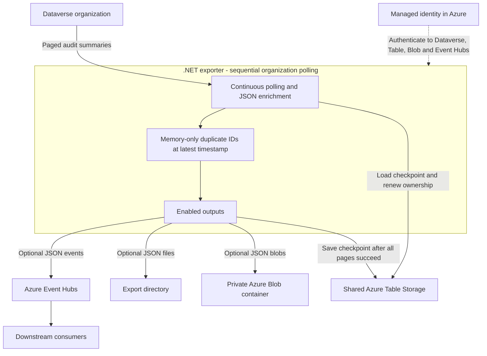

## Dataverse Audit Export

The .NET 10 console application continuously reads Dataverse audit summary records from one or more organizations and delivers them to JSON files, Azure Blob Storage, Azure Event Hubs, or any combination. Azure Table Storage holds resumable checkpoints and renewable ownership per organization. Duplicate tracking is memory-only and retains only audit IDs at the latest delivered timestamp per organization and output. The single-organization [PowerShell example](scripts/README.md) remains available separately and does not support Blob output.

### Application Architecture



Azure Container Apps runs the exporter with Event Hubs, Blob Storage, or both. Local runs can use any combination of files, Blob Storage and Event Hubs, with explicit Azure CLI authentication. Every exported JSON payload includes the organization hostname.

One exporter processes the configured organizations in order, completing all pages for org1 before starting org2. Each has its own client, checkpoint, ownership and in-memory duplicate tracking. Credentials, `StateId`, `StartFrom`, and output destination settings are shared; the selected identity needs access to every configured Dataverse organization.

Multiple exporter instances can share the same state table across organizations. Each organization/`StateId` has a separate partition, keyed by a hash of the normalized organization URL and `StateId`, containing its checkpoint and ownership row. Audit IDs are never persisted for duplicate tracking. Consumers must handle at-least-once Event Hubs delivery.

### Build and Test

Requires the .NET 10 SDK:

```powershell
dotnet build
dotnet test
dotnet run --project src/DataverseAuditExporter -- --help
```

### Local Run

Create the Azure resources with [the Bicep deployment guide](deploy/README.md), or supply an existing Table endpoint and table. Grant your Azure CLI user **Storage Table Data Contributor** on the table and, when publishing events, **Azure Event Hubs Data Sender** on the hub. Your user also needs Dataverse environment access and a security role with **View Audit Summary** (`prvReadAuditSummary`). Azure subscription permissions alone do not grant Dataverse access.

```powershell
az login --tenant <tenant-id>

dotnet run --project src/DataverseAuditExporter -- `
	--OrganizationName <organization> `
	--StorageTableEndpoint https://<account>.table.core.windows.net `
	--AuthenticationMode AzureCli `
	--ExportPath D:\DataverseAudit
```

To publish to Event Hubs instead, replace `--ExportPath` with:

```powershell
--EventHubNamespace <namespace>.servicebus.windows.net --EventHubName audits
```

To export to Blob Storage instead, replace `--ExportPath` with:

```powershell
--BlobStorageEndpoint https://<account>.blob.core.windows.net --BlobContainerName audits
```

The private container must already exist. Grant the selected identity **Storage Blob Data Contributor** scoped to that container. Shared keys, SAS URLs and connection strings are not used.

Enable any combination by supplying each destination's settings. Omitting all outputs fails startup. No local export directory is created when `ExportPath` is absent. Polling starts immediately and continues until Ctrl+C; there is no `Once` option.

### Configuration

Use `--Name value` or `--Name=value`. Precedence is CLI, then `DATAVERSE_EXPORTER_<Name>` environment variables, then credential environment aliases listed below, then the application's [settings file](src/DataverseAuditExporter/appsettings.json), then defaults. For example, `DATAVERSE_EXPORTER_AuthenticationMode=AzureCli`. Environment variable names are case-sensitive on Linux. Settings files are loaded from the executable directory. Connection strings are not supported. The application does not read `.env` files itself; Docker can load one into the container's environment with `--env-file`, as shown below.

| Setting | Meaning / Default |
| --- | --- |
| `OrganizationName` | Required: one hostname or HTTPS origin, or a comma-separated list. Legacy short names default to `crm.dynamics.com`; use the actual environment hostname to avoid regional assumptions |
| `StorageTableEndpoint` | Required: HTTPS Table service origin |
| `StateTableName` | Existing table; `DataverseAuditExporter` |
| `StateId` | Logical export identity; `default` |
| `ExportPath` | Optional file directory; disabled by default |
| `BlobStorageEndpoint`, `BlobContainerName` | Optional pair: HTTPS Blob service origin and existing private container; no SAS. Container name: 3-63 lowercase letters/digits or single hyphens, starting and ending with a letter/digit |
| `EventHubNamespace`, `EventHubName` | Optional pair enabling Event Hubs; no SAS connection string |
| `IntervalSeconds` | Target interval for a full round of organizations, 1-86400; `5`. Sleep is at least 1 second |
| `StartFrom` | ISO timestamp with offset or `Z`; used only for fresh state |
| `AuthenticationMode` | `ManagedIdentity` (default); `AzureCli` allows a final CLI fallback for local, non-container runs |
| `ManagedIdentityClientId` | Optional user-assigned identity client ID; otherwise system-assigned |
| `TenantId` | Required with client-secret credentials; otherwise optional Azure CLI tenant |
| `ClientId`, `ClientSecret` | Optional application credentials; supply both with `TenantId` |

Authentication tries **managed identity first**, then **client-secret credentials if configured**, then **Azure CLI only when explicitly enabled for local use**. The default never includes Azure CLI. Explicit `AzureCli` mode is rejected when container or Azure-host environment markers are present; do not enable it on Azure VMs or other hosted machines. Host detection is a defensive check, not a substitute for keeping the default mode in deployed workloads.

The Azure Identity chain falls back only when a credential is unavailable. Invalid credentials, failed authentication, and service authorization failures do not switch identities. Partial client-secret settings fail startup without printing the secret. A successful managed identity takes priority even when a secret is supplied.

The same credential chain is used for Dataverse, Table Storage, Blob Storage, and Event Hubs. Add the managed identity directly to Dataverse as an application user using its **application/client ID**, and assign `prvReadAuditSummary`. No separate Entra application, client secret or tenant setting is required for managed identity. If using the optional client-secret fallback, its service principal needs its own Dataverse application user with `prvReadAuditSummary`, **Storage Table Data Contributor**, **Storage Blob Data Contributor** when exporting blobs, and **Azure Event Hubs Data Sender** when publishing events; permissions are not inherited from the managed identity. See [deployment instructions](deploy/README.md) for identity, RBAC, image publishing, and Container Apps setup.

For the current summary-only API, **View Audit Summary** (`prvReadAuditSummary`) is the required audit privilege. **View Audit History** (`prvReadRecordAuditHistory`) is additionally needed for audit-detail/history functions, which this exporter does not call. Follow the [minimal Dataverse security role instructions](deploy/README.md#minimal-dataverse-security-role) instead of granting System Administrator to the application user.

Existing PowerShell credential names are supported as environment aliases: `DATAVERSE_TENANT_ID`, `DATAVERSE_CLIENT_ID`, `DATAVERSE_CLIENT_SECRET`, or the lower-priority `tenant`, `client_id`, `client_secret`. Exporter-prefixed variables override these aliases. Supply secrets through environment variables or deployment secret references, not command-line arguments, source-controlled settings, or logs. Keep local `.env` files private and untracked.

#### Multiple Organizations

Use a comma-separated list in the same environment variable. In a Docker `.env` file, do not wrap the value in quotes:

```dotenv
DATAVERSE_EXPORTER_OrganizationName=contoso.crm4.dynamics.com,fabrikam.crm4.dynamics.com
```

The equivalent PowerShell CLI argument is `--OrganizationName 'contoso.crm4.dynamics.com,fabrikam.crm4.dynamics.com'`. In application settings, use a string: `"OrganizationName": "contoso.crm4.dynamics.com,fabrikam.crm4.dynamics.com"`. Whitespace around entries is trimmed. A single organization is also supported. Empty lists, empty entries and duplicate normalized organization URLs are rejected. Use the actual hostname or HTTPS origin from each environment; no regional suffix needs to be inferred.

After each full round, the exporter sleeps for `max(1 second, IntervalSeconds - total round duration)`, including time spent on requests, retries, and ownership operations. For an interval of 5 seconds, a 2-second round sleeps 3 seconds; a 7-second round still sleeps 1 second. There is no extra sleep between organizations. A transient failure or an organization owned by another instance does not prevent the next organization from being attempted; incompatible saved-state configuration still stops the application for operator intervention. Long backfills or retries delay the organizations later in the list.

File output always uses `ExportPath/<organization-host>/yyyy/MM/dd/<auditid>.json`, including when only one organization is configured. Adding, removing or reordering organizations does not change the remaining organizations' output paths, destination fingerprints or checkpoint keys. Exports created by an older app version without the hostname directory are not moved automatically; upgrading those file exports changes their destination fingerprint and requires a new `StateId` for a fresh export. Event-Hubs-only exports are unaffected by this file-layout change.

### Delivery and Recovery

Blob output writes one UTF-8 JSON blob per audit at `<organization-host>/yyyy/MM/dd/<auditid>.json`, with UTC dates and `application/json; charset=utf-8` content type. The hostname prefix is always present, even for a single organization. Conditional uploads never overwrite existing blobs. Only a successful upload or an explicit already-existing response acknowledges delivery; other failures prevent checkpoint advancement. Treat completed blobs as immutable. Deleting or expiring blobs does not rewind checkpoints or guarantee re-export. Set lifecycle/retention policies deliberately; none are installed by the exporter.

- The API is `/api/data/v9.2/audits`, ordered by `createdon`, following every `@odata.nextLink`. Output preserves the returned audit fields and annotations, adding or replacing the top-level `organization` field with the configured hostname, for example `"organization": "contoso.crm4.dynamics.com"`. This field is included in JSON files, blobs and Event Hubs message bodies; existing exports are not rewritten. This exports summary records, not the additional old/new field values returned by `RetrieveAuditDetails`.
- Files always use `ExportPath/<organization-host>/yyyy/MM/dd/<auditid>.json` with UTC dates, UTF-8 without BOM, and atomic same-directory moves. Existing files are not overwritten, including after a restart. Treat successful output files as immutable; deleting a file does not cause the checkpoint to move backwards or guarantee re-export.
- Event Hubs receives one audit JSON object per event. Message properties include `auditid`, `organization`, and `createdon`. The separate `organization` message property retains the HTTPS origin (for example `https://contoso.crm4.dynamics.com`); the JSON body field contains only the hostname. Records are batched to the SDK's size limit; an oversized single record fails the cycle without skipping it.
- A checkpoint advances only when all pages have reached every enabled output. On failure the next cycle resumes the last durable checkpoint. Each output keeps an in-memory set of successfully delivered IDs at its latest timestamp, including ties across pages and polling cycles. A newer delivered timestamp replaces that set; older retry records are not added to it. Historical scans therefore do not accumulate a history of IDs in memory or storage. Memory use depends on how many records share the latest timestamp, not on the total exported history.
- Queries restart inclusively at the last `createdon`, preserving fractional precision and handling records with equal timestamps. Records that become visible late with timestamps **older** than that boundary can be missed; this is the reference script's watermark behavior, not an arbitrary-lateness guarantee.
- Event Hubs delivery is **at least once**, not exactly once. Retries can resend records older than the in-memory boundary. Restarts lose all remembered IDs and can resend records at the checkpoint timestamp, plus records sent after the last saved checkpoint. Consumers must deduplicate by organization plus `auditid`. No cross-partition global ordering is guaranteed.
- Table state contains only the versioned `checkpoint` row with configuration and ownership for each organization/`StateId`; no per-audit receipts are read or written. A failed initial historical scan restarts from its saved initial lower bound and may resend already published events.
- Instances coordinate ownership per organization using a 60-second renewable Table lease with ETags. An organization owned elsewhere is skipped for the current round; failed renewal cancels its work before lease expiry. Ownership is renewed during each organization's export and released before proceeding to the next organization. Container Apps can briefly overlap replicas during rollout, so min/max replicas of one alone is insufficient. Cooperative ownership cannot fence an already in-flight Event Hubs send; duplicate handling is still required.
- Saved state takes precedence over `StartFrom`. To intentionally replay or change destinations, use a new `StateId`; changing destinations with existing state fails. Replaying to the same file path leaves existing files intact. Do not run local and cloud instances with different outputs under the same state ID.

State tables and Blob containers must already exist. The application does not migrate the PowerShell state or audit-ID files, create Azure resources, or grant itself permissions. Adding Blob output or changing its endpoint/container changes the destination fingerprint: use a new `StateId` for a deliberate fresh export. Existing checkpoints remain compatible when Blob output is disabled. Neither tokens nor audit payloads are logged. An exporter intentionally blocked on a bad/oversized record needs operator intervention; it never silently discards the record.

Existing checkpoints remain compatible. Historical receipt rows from older versions are ignored and are not automatically deleted. Once all old exporters are stopped and upgraded, those receipt rows can be removed; keep every `checkpoint` row. Do not run an older exporter concurrently with cleanup.

### Container

```powershell
docker build -t dataverse-audit-exporter:dev src/DataverseAuditExporter
docker run --rm dataverse-audit-exporter:dev --help
```

The Linux image runs as a non-root user. The project-only build context excludes PowerShell exports and credentials. Container Apps uses Event Hubs and/or Blob Storage because its local filesystem is ephemeral. Actual Azure deployment is a separate operation described in [deploy/README.md](deploy/README.md).

#### Docker with an Environment File

Example `.env` in the repository root, using Docker's `NAME=value` format without quotes or `export` prefixes. Replace the example organization and resource names with your own:

```dotenv
DATAVERSE_EXPORTER_OrganizationName=contoso.crm4.dynamics.com,fabrikam.crm4.dynamics.com
DATAVERSE_EXPORTER_StorageTableEndpoint=https://examplestate.table.core.windows.net
DATAVERSE_EXPORTER_StateTableName=DataverseAuditExporter
DATAVERSE_EXPORTER_StateId=default
DATAVERSE_EXPORTER_AuthenticationMode=ManagedIdentity
DATAVERSE_EXPORTER_EventHubNamespace=exampleaudit.servicebus.windows.net
DATAVERSE_EXPORTER_EventHubName=audits
DATAVERSE_EXPORTER_IntervalSeconds=5
```

For a user-assigned identity, also set `DATAVERSE_EXPORTER_ManagedIdentityClientId` to its client ID. Omit it for the host's system-assigned identity. The identity must already have the Azure data roles and Dataverse application-user permissions described above.

To enable Blob output, add these settings. Remove the Event Hubs pair for Blob-only output; no volume mount is needed:

```dotenv
DATAVERSE_EXPORTER_BlobStorageEndpoint=https://exampleexports.blob.core.windows.net
DATAVERSE_EXPORTER_BlobContainerName=audits
```

For Docker Desktop or another host without managed identity, use an existing service principal for the optional client-secret fallback and add the following to the same `.env` file. Replace placeholders privately with its tenant ID, application/client ID, and client secret **value**, not the secret ID:

```dotenv
DATAVERSE_EXPORTER_TenantId=<tenant-id>
DATAVERSE_EXPORTER_ClientId=<application-client-id>
DATAVERSE_EXPORTER_ClientSecret=<client-secret-value>
```

The existing `tenant`, `client_id`, and `client_secret` names also work when loaded by Docker. Leave `AuthenticationMode=ManagedIdentity`: it remains the first attempt, with the configured secret as fallback when managed identity is unavailable.

Run from the repository root. Either provide the fallback credentials above or use a managed-identity-enabled Azure host where the container can reach the identity endpoint:

```powershell
docker run --rm --env-file .env dataverse-audit-exporter:dev
```

To enable file output as well, mount a host directory and pass its **container path** as `ExportPath`:

```powershell
docker run --rm --env-file .env `
	--mount "type=bind,source=$((Get-Location).Path)/Exports,target=/exports" `
	dataverse-audit-exporter:dev --ExportPath /exports
```

Create the host `Exports` directory beforehand and make it writable by the image's non-root user. Omit the Event Hubs and Blob output variables from `.env` for file-only output; Table Storage is still required. The file is consumed by Docker, not copied into the image or mounted into the container. CLI arguments override values supplied through `.env`.

**Docker Desktop authentication:** use the client-secret settings above. The image has no Azure CLI, does not inherit your host's `az login` session, and rejects `AuthenticationMode=AzureCli`. For local non-container development, the `dotnet run` example enables CLI as the last fallback; do not configure a secret when you intend to use only your developer login after managed identity is unavailable. Azure Container Apps receives its environment and managed identity through the Bicep deployment instead of this Docker command; that deployment remains managed-identity-only unless you separately configure secret references.

## Links

[Retrieve the history of audited data changes](https://learn.microsoft.com/en-us/power-apps/developer/data-platform/auditing/retrieve-audit-data?tabs=webapi)

[audit EntityType](https://learn.microsoft.com/en-us/power-apps/developer/data-platform/webapi/reference/audit?view=dataverse-latest)
